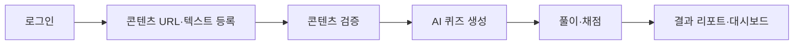
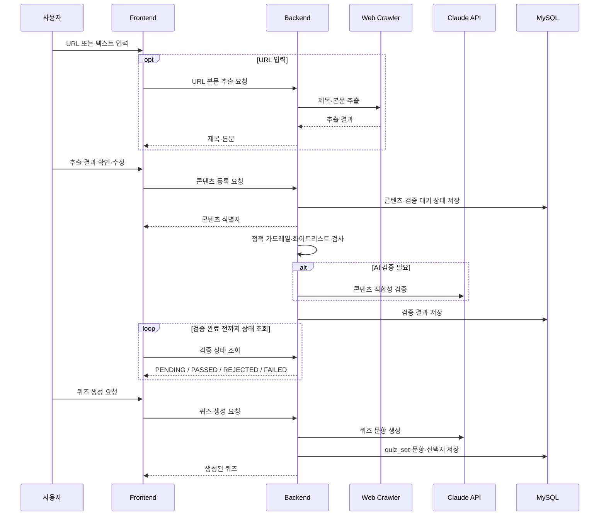
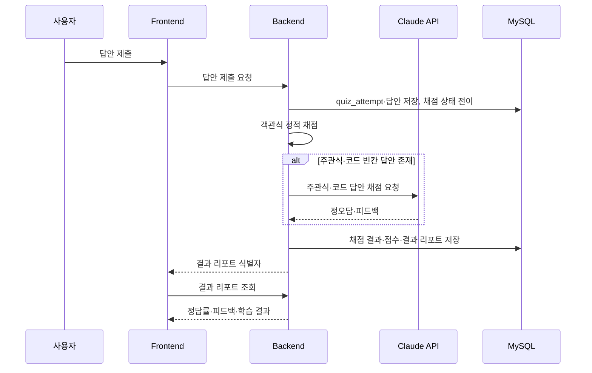
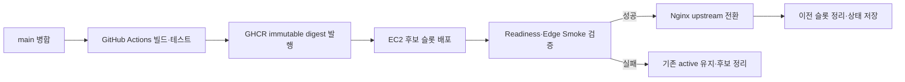
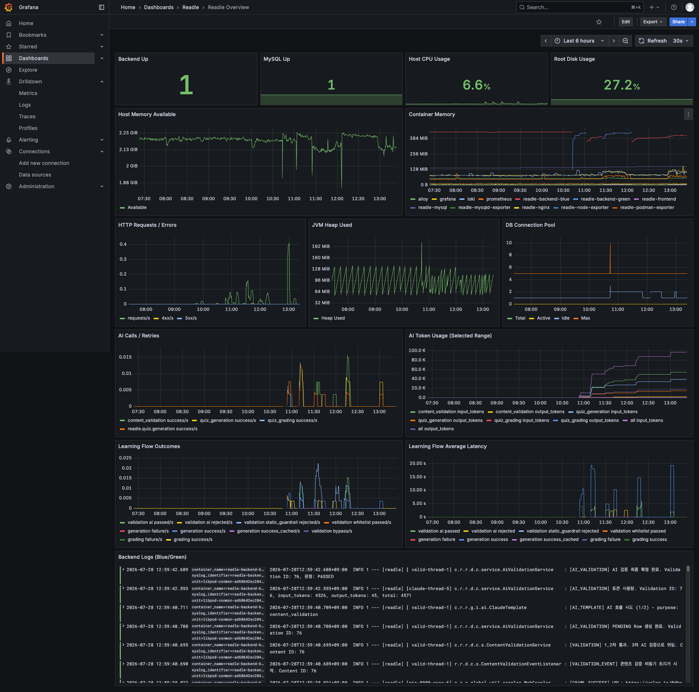
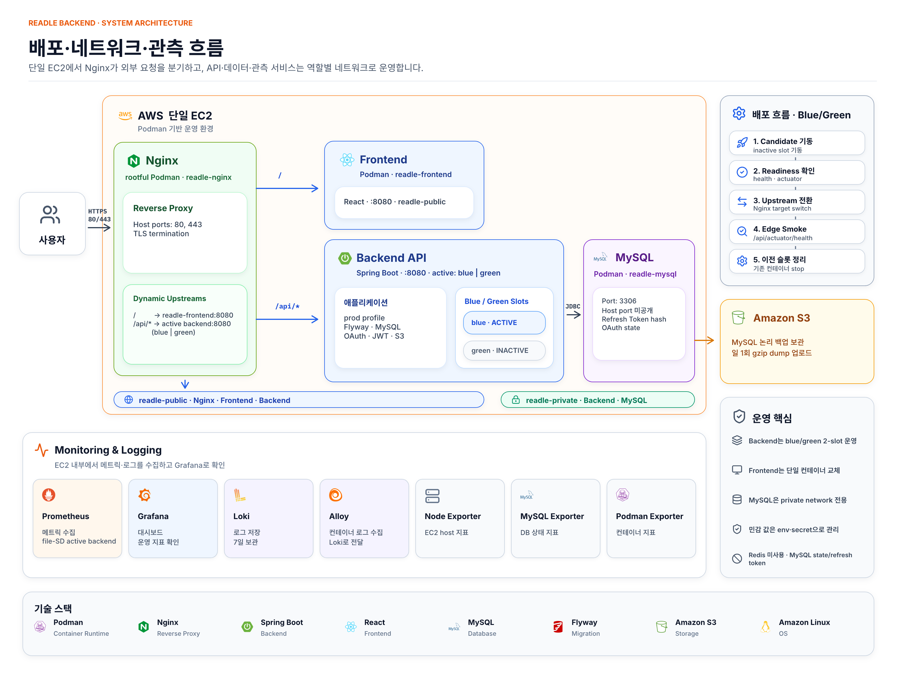

# Readle 백엔드

<p align="center">
  
</p>

<p align="center">
  <strong>읽었다를 이해했다로</strong><br />
  기술 아티클을 AI 퀴즈와 피드백으로 바꾸는 개발자용 액티브 러닝 플랫폼
</p>

<p align="center">
  <a href="https://spring.io/projects/spring-boot"></a>
  <a href="https://openjdk.org/"></a>
  <a href="https://www.mysql.com/"></a>
  <a href="https://flywaydb.org/"></a>
  <a href="https://nginx.org/"></a>
  <a href="https://podman.io/"></a>
  <a href="https://www.anthropic.com/"></a>
  <a href="https://github.com/features/actions"></a>
  <a href="https://aws.amazon.com/"></a>
  <a href="https://prometheus.io/"></a>
  <a href="https://grafana.com/"></a>
  <a href="https://grafana.com/oss/loki/"></a>
  <a href="https://grafana.com/oss/alloy-opentelemetry-collector/"></a>
</p>

## 서비스 소개

Readle은 개발 기술 아티클을 읽은 뒤 핵심 내용을 스스로 설명하고 적용해 보도록 돕는 학습 서비스다. URL 또는 텍스트로 콘텐츠를 등록하면 적합성을 검증하고, Claude 기반 퀴즈를 생성·채점해 결과 리포트와 학습 현황을 제공한다.

## 주요 기능

### 콘텐츠 등록 및 검증

- URL 본문 추출 또는 텍스트 직접 입력을 지원한다.
- 정적 가드레일, 화이트리스트 fast-pass, AI 적합성 검증으로 학습 가능한 개발 콘텐츠만 통과시킨다.

### AI 퀴즈 생성

- 검증된 콘텐츠를 바탕으로 객관식·주관식·코드 빈칸 문제를 생성한다.
- 생성 상태와 재생성 흐름을 관리해 실패 이력을 보존한다.

### 풀이·채점·결과 리포트

- 객관식은 정적으로 채점하고, 주관식·코드 빈칸은 AI 기반 의미 채점과 피드백을 제공한다.
- 대시보드에서 누적 학습 현황과 태그별 학습 횟수·평균 정답률을 조회할 수 있다.

### 인증 및 보안

- Kakao·Google OAuth 로그인과 PKCE, 일회성 OAuth state를 지원한다.
- JWT Access Token, HttpOnly Refresh Cookie, MySQL 기반 Refresh Token 폐기로 세션 없는 API 인증을 구성한다.

## 학습 흐름



## 핵심 처리 흐름

### 콘텐츠 검증·퀴즈 생성



### 답안 제출·AI 채점·결과 리포트



### CI/CD·Blue/Green 배포



## 기술 스택 및 운영 환경

| 항목 | 현재 값 |
| --- | --- |
| Java | 17 |
| Spring Boot | 3.5.16 |
| 기본 프로필 | `local` |
| 데이터베이스 | MySQL, Flyway migration, JPA ddl-auto는 환경별 설정 |
| 인증 | Kakao/Google OAuth, JWT Access Token, MySQL Refresh Token |
| AI 연동 | Anthropic Claude Messages API |
| 리버스 프록시·컨테이너 | Nginx, rootful Podman |
| CI/CD | GitHub Actions, GHCR immutable digest 배포 |
| 관측·로그 | Actuator, Micrometer Prometheus, Prometheus, Grafana, Loki, Alloy |
| 백업 | MySQL logical backup을 Amazon S3에 보관 |
| 문서 UI | springdoc OpenAPI UI |
| 운영 확인 | Spring Boot Actuator health/prometheus, Grafana dashboard |

## 관측 환경

배포 환경의 Grafana는 `https://<service-host>/grafana/`에서 확인할 수 있으며, 운영자가 관리하는 계정으로 로그인해야 합니다.



- 인프라 상태와 백엔드 health·HTTP·JVM·DB connection pool을 확인합니다.
- AI 호출·토큰 사용량과 콘텐츠 검증·퀴즈 생성·채점 흐름을 관측합니다.
- Loki 로그를 통해 backend/frontend/Nginx 컨테이너 로그를 조회합니다.
- Prometheus 메트릭 endpoint와 Grafana 자격 증명은 외부에 공개하지 않습니다.

설치·업데이트·검증·장애 대응 절차는 [배포 운영 문서](docs/DEPLOYMENT.md)를 참고합니다.

## 빠른 시작

```bash
./gradlew test
./gradlew bootRun
```

환경 변수와 MySQL 준비 절차는 [로컬 개발 환경](docs/LOCAL_DEV.md)을 참고하세요.

## 시스템 아키텍처



외부 요청은 EC2의 Nginx에서 종료·분기하며, 애플리케이션과 MySQL은 Podman private network에서 통신한다. OAuth·Claude·S3는 외부 연동이고, Prometheus/Grafana/Loki는 운영 관측을 담당한다.

## 주요 모듈

- `domain/auth`: OAuth 시작/콜백, Access Token 재발급, 로그아웃, 현재 사용자 조회
- `domain/content`: URL 본문 추출, 콘텐츠 등록, 정적 가드레일/화이트리스트/AI 검증
- `domain/quiz`: 퀴즈 생성, 풀이 시작, 답안 제출, 결과 조회
- `domain/dashboard`: 결과 리포트 기반 학습 현황 집계
- `global/security`: JWT 인증 필터, OAuth/CSRF cookie, Prometheus endpoint 보호
- `global/infrastructure/ai`: Claude API client, prompt loading, AI 호출 계측

## API 문서

- 로컬: [http://localhost:8080/swagger-ui/index.html](http://localhost:8080/swagger-ui/index.html)
- 배포: [https://app.readle.kro.kr/swagger-ui/index.html](https://app.readle.kro.kr/swagger-ui/index.html)

## 팀 역할 및 주요 기여

> 프론트엔드·백엔드 Git 커밋 기준으로 정리했으며, 구현 외 기획·리뷰·회의 기여는 포함하지 않는다.

### 👨‍💻 전성 — 프론트엔드·학습 현황

사용자 학습 흐름의 화면 경험과 학습 현황 조회 기능을 구축했습니다.

| 영역 | 내용 |
| --- | --- |
| 공통 UI | 디자인 시스템, 공통 레이아웃·라우팅, 랜딩·소셜 로그인 UI 구현 |
| 학습 흐름 | 콘텐츠 입력, 퀴즈 풀이·채점·결과 리포트 화면과 API 연동 구현 |
| 학습 현황 | 대시보드·학습 히스토리 UI, 커서 페이지네이션·모바일·접근성 개선 |
| 백엔드 | 자동 태깅, 대시보드 집계, 학습 히스토리·결과 리포트 API 구현 |

### 👩‍💻 김세희 — 콘텐츠 검증·AI 안정화

콘텐츠 수집·검증 파이프라인과 AI 호출의 안정성을 강화했습니다.

| 영역 | 내용 |
| --- | --- |
| 콘텐츠 검증 | URL 크롤링, 정적 가드레일·화이트리스트·AI 적합성 검증, 검증 재시도 구현 |
| 안정성·보안 | 프롬프트 인젝션 방어, 비관적 락 기반 동시성 제어, 크롤링 노이즈·예외 처리 개선 |
| AI 연동 | Claude 템플릿 공통화, 스키마 재시도·타임아웃·인터럽트 처리 보완 |
| 프론트 파이프라인 | 콘텐츠 검증·퀴즈 생성 상태 폴링, 입력 복원, 실패·재시도 UX 구현 |

### 👨‍💻 서일현 — 인증·인프라·운영

OAuth/JWT 기반 인증과 EC2 운영 자동화·관측 환경을 구축했습니다.

| 영역 | 내용 |
| --- | --- |
| 인증·보안 | Kakao·Google OAuth, PKCE, JWT Access Token, Refresh Token·Cookie, Security 경계 구현 |
| 배포 자동화 | Podman Blue/Green 배포·롤백, GHCR digest 기반 CI/CD, Nginx upstream 전환 구성 |
| 운영 안정성 | MySQL S3 백업, 런타임 검증·복구 경로, Prometheus·Grafana·Loki·Alloy 관측 환경 구축 |
| 프론트 연동 | 인증 상태·보호 라우트·세션 만료 UX 연동 |

### 👨‍💻 장성재 — 퀴즈·AI 채점

퀴즈 생성부터 답안 제출·AI 채점·결과 복구까지의 핵심 학습 도메인을 구현했습니다.

| 영역 | 내용 |
| --- | --- |
| 퀴즈 생성 | 생성·재생성 흐름, 동시 요청 제어, 품질 가드레일과 실패 복구 처리 구현 |
| 풀이·채점 | 답안 제출, AI 채점, 결과 리포트 계약과 상태 전이·롤백 처리 안정화 |
| AI 견고성 | 프롬프트 인젝션·JSON 파싱 방어, 타임아웃·예외 처리, 응답 품질 보완 |
| 프론트 연동 | 퀴즈 API 연동, 제출 경쟁 조건 방어, 사용자 오류 안내 UX 구현 |

## 문서

- [기여 가이드: Git·PR·코드 컨벤션](CONTRIBUTING.md)
- [로컬 개발 환경](docs/LOCAL_DEV.md)
- [백엔드 이미지 배포 계약](docs/DEPLOYMENT.md)
- [API 설계](docs/design/API.md)
- [인증 설계](docs/design/AUTH_DESIGN.md)
- [AI 설계](docs/design/AI_DESIGN.md)
- [ERD](docs/design/ERD.md)
- [인프라 운영 정책](docs/design/INFRA_POLICY.md)
- [ADR 목록](docs/adr/)
