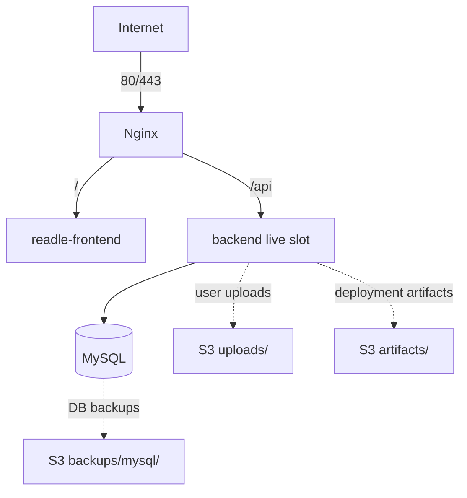

# ADR-008: 단일 EC2에서는 rootful Podman 기반 단순 인프라와 backend 임시 Blue-Green 배포를 사용한다

## 상태

Accepted

## 배경

MVP 인프라는 EC2 1대와 S3 1개를 전제로 한다.

EC2 사양은 RAM 4GB, EBS 50GB이며, 프론트엔드, 백엔드, MySQL은 rootful Podman 컨테이너로 배포한다. 외부 트래픽은 `readle-nginx`가 받아 프론트엔드와 백엔드로 포워딩한다.

EC2 보안 그룹에서 개방 포트는 다음과 같다.

- 22
- 80
- 443
- 3000
- 8000-8100

현재 배포에 사용하는 AWS 접근 권한은 보안 그룹 수정 권한을 갖고 있지 않다. 따라서 MVP에서는 추가 네트워크 구성을 전제로 하지 않고, 이미 허용된 80/443 포트의 Nginx 뒤에 프론트엔드까지 EC2에 적재한다.

초기에는 프론트엔드와 백엔드 Blue-Green, Redis cache/state 분리, Redis 기반 Refresh Token 저장을 검토했다. 하지만 단일 EC2와 4GB RAM 제약에서는 상시 이중 실행과 Redis 운영이 메모리와 운영 복잡도를 빠르게 증가시킨다.

따라서 Blue-Green은 backend 배포 시점의 임시 전환 절차로 제한하고, frontend는 비라우팅 preflight 후 단일 live 교체만 사용하며, Redis는 MVP 기본 구성에서 제외한다.

## 결정

MVP 인프라는 단일 EC2 안에서 rootful Podman 기반으로 운영한다.

- `readle-nginx`는 rootful Podman 컨테이너에서 80, 443 요청을 받는다.
- 프론트엔드는 S3 정적 호스팅이나 별도 호스팅으로 분리하지 않고 EC2에 Podman 이미지로 함께 적재한다.
- 프론트엔드와 백엔드는 Podman 내부 네트워크에서만 접근 가능하게 둔다.
- 프론트엔드는 Blue-Green 배포 대상에서 제외하고, `readle-frontend-candidate` 비라우팅 preflight 후 `readle-frontend` 단일 live를 교체한다.
- 백엔드는 평시 배포 state가 가리키는 backend live slot 1개만 운영한다.
- backend live slot은 `readle-backend-blue` 또는 `readle-backend-green` 중 하나일 수 있다.
- 백엔드 Blue-Green은 배포 시 inactive backend slot을 candidate role로 임시 기동하는 절차로만 사용한다.
- candidate role의 backend가 health check를 통과하면 Nginx upstream을 candidate role로 전환하고 기존 active backend를 종료한다.
- MySQL은 Blue-Green 배포 대상에서 제외하고 단일 인스턴스로 운영한다.
- Redis는 MVP 기본 구성에서 제외한다.
- Refresh Token은 ADR-007에 따라 MySQL에 hash로 저장한다.
- MySQL 데이터는 Podman volume 또는 명시적인 EBS mount에 저장한다.
- S3는 사용자 업로드 파일, DB 백업, 배포 산출물 보관 용도로 사용한다.
- frontend/backend candidate 동시 배포는 지원하지 않는다.
- 로그 검색은 ADR-012의 staged exception에 한해 EC2-local Loki와 Alloy를 사용한다. Loki와 Alloy는 `readle-private`에서만 동작하고 host port를 publish하지 않는다.
- Loki/Alloy enable 여부는 backend 배포 조건이 아니며, 실패 시 로그는 journald-only로 유지한다.

## 이유

단일 EC2에서는 인프라 자체가 단일 장애점이다. 이 제약 안에서 Kubernetes, ECS, ALB, RDS, ElastiCache 같은 구조를 흉내 내면 가용성은 크게 오르지 않고 운영 복잡도만 증가한다.

rootful Podman은 단일 호스트에서 여러 컨테이너를 관리하기에 충분하며, MVP 단계에서 가장 단순한 운영 단위다.

Nginx가 외부 요청을 모두 받고 내부 컨테이너로 프록시하면 프론트엔드와 백엔드 포트를 외부에 직접 공개하지 않아도 된다. 현재 AWS 접근 권한으로 보안 그룹을 수정할 수 없으므로, 프론트엔드도 EC2 내부에 적재하고 이미 허용된 80/443 경로로 제공하는 편이 운영 제약에 맞다.

프론트엔드는 상태 없는 정적 애플리케이션 컨테이너다. 새 이미지는 `readle-frontend-candidate`에서 내부 `/` preflight만 수행하고 외부 라우팅을 받지 않는다. preflight 성공 후 candidate를 제거하고 `readle-frontend` 단일 live를 교체하면 충분하므로 Blue-Green을 적용해 얻는 이득보다 컨테이너와 Nginx 분기 복잡도가 더 크다.

백엔드도 평시에 active/candidate를 모두 띄우면 4GB RAM에서 메모리 여유가 줄어든다. 다만 CD를 구성하면 main branch merge 또는 배포 트리거마다 backend 배포가 반복될 수 있다. 이때 단순 recreate 배포는 기존 backend를 먼저 내린 뒤 새 컨테이너를 띄우므로, 짧은 중단이나 배포 실패가 서비스/API 테스트 흐름에 바로 노출된다.

따라서 백엔드는 상시 이중 실행하지 않되, 배포 시에만 candidate를 먼저 띄워 health check를 수행한다. candidate가 검증을 통과한 경우에만 Nginx upstream을 전환하면, 실패한 배포는 기존 active backend를 유지한 채 폐기할 수 있다. 이는 CD 환경에서 배포 횟수가 늘어나는 상황과 4GB EC2의 메모리 제약 사이의 최소 타협안이다.

Redis는 Refresh Token, cache, queue 용도로 검토했지만 MVP에서는 모두 기본 구성에서 제외한다. Refresh Token은 MySQL로 대체하고, cache와 queue는 계측된 병목이나 비동기 처리 요구가 확인될 때 도입하는 편이 단순하다.

## 고려한 대안

### 프론트엔드까지 라우팅 전환 대상으로 운영

프론트엔드와 백엔드를 모두 라우팅 전환 대상으로 띄워두는 방식이다.

장점:

- 전환 대상이 명확하다.
- 이전 버전을 잠시 보관하여 빠른 롤백이 가능하다.

단점:

- 4GB RAM에서 리소스 부담이 크다.
- 프론트엔드는 비라우팅 preflight 후 단일 live 교체로 충분하다.
- Nginx upstream과 배포 스크립트가 불필요하게 복잡해진다.

### 백엔드만 배포 시 임시 Blue-Green 사용

평시에는 backend live slot 1개만 띄우고, 배포 시 inactive backend slot을 candidate role로 임시 기동하는 방식이다.

장점:

- 평시 메모리 사용량이 작다.
- 요청 처리 중단 위험이 큰 백엔드에만 전환 절차를 둔다.
- CD로 배포 횟수가 늘어나도 실패한 candidate를 기존 active에 노출하지 않을 수 있다.
- 배포 실패 시 Nginx upstream을 기존 active로 유지하면 된다.

단점:

- 배포 중에는 backend 컨테이너가 2개라 일시적으로 메모리 사용량이 증가한다.
- Nginx upstream 전환과 rollback 스크립트가 단순 recreate보다 복잡하다.
- 이전 버전을 오래 보관하는 롤백 전략은 제한된다.

### Redis를 cache/state로 운영

Redis cache와 Redis state를 분리하거나, Redis 하나를 논리 DB로 나누는 방식이다.

장점:

- Refresh Token TTL 처리와 cache 구현이 쉽다.
- 일부 비동기 queue를 Redis로 처리할 수 있다.

단점:

- 단일 4GB EC2에서 상시 메모리 예산을 추가로 사용한다.
- Redis 장애와 백업/모니터링 대상이 늘어난다.
- 192MB 수준의 cache는 기대 hit ratio 대비 운영 복잡도가 크다.
- Refresh Token만을 위해 Redis를 운영하기에는 비용이 크다.

### Redis를 제거하고 MySQL만 사용

Refresh Token은 MySQL에 저장하고, cache와 queue는 MVP 범위에서 제외하는 방식이다.

장점:

- 운영 컴포넌트가 줄어든다.
- 메모리를 MySQL, backend, 모니터링, OS 여유분에 배분할 수 있다.
- 백업과 장애 대응 경로가 단순해진다.

단점:

- Refresh Token 재발급 시 DB 조회가 필요하다.
- 만료 토큰 cleanup job이 필요하다.
- cache와 queue가 필요한 시점에는 별도 도입이 필요하다.

## 결과

MVP에서는 단일 EC2 + S3 구성을 유지하되, 인프라 구조는 다음을 기준으로 한다.

평시 컨테이너는 다음만 실행한다.

- `readle-nginx`
- `readle-frontend`
- backend live slot (`readle-backend-blue` 또는 `readle-backend-green`)
- `mysql`
- monitoring 도구
- logging 도구는 ADR-012 capacity gate 통과 시에만 Loki/Alloy로 추가

백엔드 배포 흐름은 다음을 기준으로 한다.

1. 현재 active backend를 확인한다.
2. 새 backend 이미지를 inactive backend slot에 candidate role로 임시 기동한다.
3. candidate health check를 확인한다.
4. Nginx upstream을 candidate role로 전환한다.
5. `nginx -t`를 통과한 경우에만 reload한다.
6. reload 후 `/api/actuator/health/readiness` smoke check를 수행한다.
7. 성공하면 기존 active backend를 중지한다.
8. 실패하면 Nginx upstream을 기존 active로 유지하거나 되돌리고 candidate를 제거한다.

프론트엔드 배포는 `readle-frontend-candidate`로 비라우팅 preflight를 수행한 뒤 `readle-frontend` 단일 live를 교체하고, 실패 시 durable previous state로 되돌린다. Loki/Alloy 포함 frontend-only 배포 중 memory hard cap 합계는 `3392MB`, host reserve는 약 `704MB`다.

Loki/Alloy 포함 backend candidate 배포 중 memory hard cap 합계 `3840MB`는 staged exception이다. 이 값은 평시 계약이 아니며, enable 전 실제 candidate와 logging stack을 띄운 뒤 3분 안정화 구간을 거쳐 15분 동안 `MemAvailable >= 576MB`, 분당 swap-in `<= 1MiB`, memory PSI `some`·`full`의 `avg10 < 0.10`, 모든 sample의 5-minute load average `< 1.5`, root filesystem 여유 `10GB` 이상 및 `20%` 이상, OOM 없음이 확인되어야 한다. swap-out은 evidence만 기록하며 단독 실패 조건으로 사용하지 않는다. frontend/backend candidate 동시 배포는 지원하지 않는다.

추후 다음 조건이 생기면 구조를 재검토한다.

- EC2 1대 장애를 견뎌야 하는 경우
- DB 장애 복구 시간이 서비스 요구사항을 넘는 경우
- Refresh Token 조회 부하가 MySQL에 의미 있는 병목을 만드는 경우
- cache hit ratio가 계측되고 Redis에 최소 512MB 이상을 배정할 수 있는 경우
- queue 유실 방지 또는 재처리 요구가 생기는 경우
- 트래픽 증가로 4GB RAM 안에서 임시 Blue-Green 배포가 불안정해지는 경우
- 운영자가 직접 배포 스크립트와 서버 상태를 관리하기 어려워지는 경우

그 시점에는 Redis, RDS, ElastiCache, SQS, ALB, ECS 또는 Kubernetes 도입을 별도 ADR로 검토한다.
