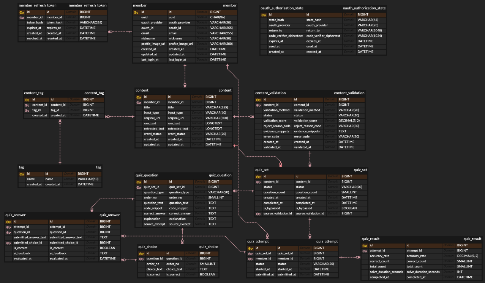

# ERD

## 상태

이 문서는 현재 Flyway migration을 기준으로 한 backend-local 데이터 모델 요약이다. 실행 기준은 `src/main/resources/db/migration`이다.

## ERD 다이어그램

## 설계 원칙

- MySQL InnoDB와 `utf8mb4`를 사용한다.
- JPA는 기본 설정에서 schema validate로 동작한다.
- 외부 사용자 식별자는 `member.uuid`를 사용하고 내부 PK `id`는 API 사용자 식별자로 노출하지 않는다.
- OAuth identity는 `(oauth_provider, oauth_id)` 복합 unique key로 식별한다.
- Refresh Token과 OAuth state는 원문 대신 hash 또는 encrypted verifier를 저장한다.
- 상태값은 `VARCHAR`와 `CHECK` constraint로 제한한다.
- 결과 리포트는 별도 학습 기록 테이블이 아니라 `quiz_result` 기반 read projection이다.

## 테이블 목록

| Table | 역할 |
| --- | --- |
| `member` | OAuth 기반 회원 |
| `member_refresh_token` | Refresh Token hash와 만료/폐기 시각 |
| `oauth_authorization_state` | OAuth state hash, return path, encrypted PKCE verifier |
| `content` | URL 또는 텍스트 학습 콘텐츠 |
| `content_validation` | 콘텐츠 검증 이력 |
| `quiz_set` | 콘텐츠 기반 퀴즈 생성 단위 |
| `quiz_question` | 퀴즈 문항 |
| `quiz_choice` | 객관식 선택지 |
| `quiz_attempt` | 사용자 풀이 진행 상태 |
| `quiz_answer` | 문제별 답안과 채점 결과 |
| `quiz_result` | 완료된 풀이 결과 리포트 |
| `tag` | 태그 마스터 |
| `content_tag` | 콘텐츠-태그 연결 |

## 핵심 관계

- `member 1:N content`
- `member 1:N member_refresh_token`
- `content 1:N content_validation`
- `content 1:N quiz_set`
- `content_validation 1:1 quiz_set` via unique `quiz_set.source_validation_id`
- `quiz_set 1:N quiz_question`
- `quiz_question 1:N quiz_choice`
- `quiz_set 1:N quiz_attempt`
- `member 1:N quiz_attempt`
- `quiz_attempt 1:N quiz_answer`
- `quiz_attempt 1:1 quiz_result`
- `content N:M tag` via `content_tag`

## 주요 상태값

| 컬럼 | 값 |
| --- | --- |
| `member.oauth_provider` | `GOOGLE`, `KAKAO` |
| `content.input_type` | `URL`, `TEXT` |
| `content.crawl_status` | `NOT_APPLICABLE`, `SUCCESS`, `FAILED` |
| `content_validation.validation_method` | `AI`, `WHITELIST`, `STATIC_GUARDRAIL` |
| `content_validation.status` | `PENDING`, `PASSED`, `REJECTED`, `FAILED` |
| `content_validation.reject_reason_code` | `EMPTY_CONTENT`, `CONTENT_TOO_SHORT`, `BAD_WORD`, `PROMPT_INJECTION_DETECTED`, `NOT_DEVELOPMENT_RELATED`, `LOW_CONFIDENCE` |
| `content_validation.error_code` | `AI_SERVICE_ERROR`, `TIMEOUT`, `SCHEMA_INVALID`, `UNKNOWN_ERROR` |
| `quiz_set.status` | `GENERATING`, `COMPLETED`, `FAILED` |
| `quiz_question.question_type` | `MULTIPLE_CHOICE`, `SHORT_ANSWER`, `CODE_BLANK` |
| `quiz_attempt.status` | `IN_PROGRESS`, `GRADING`, `SUBMITTED` |

## Migration 요약

| Migration | 내용 |
| --- | --- |
| `V1__init_schema.sql` | 기본 도메인 schema 생성 |
| `V2__security_foundation.sql` | OAuth authorization state table 추가 |
| `V3__add_quiz_set_unique_source_validation.sql` | `quiz_set.source_validation_id` unique constraint 추가 |
| `V4__add_grading_status.sql` | `quiz_attempt.status`에 `GRADING` 추가 |
| `V5__add_schema_invalid_to_error_code.sql` | `content_validation.error_code`에 `SCHEMA_INVALID` 추가 |

## 관련 문서

- [API 설계](API.md)
- [인증 설계](AUTH_DESIGN.md)
- [AI 설계](AI_DESIGN.md)
- [ADR-013](../adr/ADR-013.md)
- [ADR-018](../adr/ADR-018.md)
